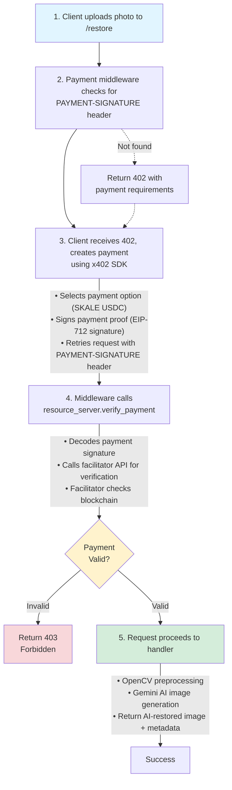

# Photo Restoration API

**Technology Against Erasure: Preserving memories, honoring history**

> *"Those who cannot remember the past are condemned to repeat it."* — George Santayana, The Life of Reason (1905)

A production-ready Python API that restores and colorizes old photographs using computer vision and AI. Built with FastAPI, OpenCV, and Gemini 2.5 Flash Image for native image generation. Payments via x402 protocol on SKALE network.

## What is this?

This example monetizes AI photo restoration using [x402 protocol](https://blog.kobaru.io/x402-http-payment-protocol/) payments. Photo restoration is more than improving old images—it's about **honoring those who came before us** and **respecting diverse histories**.

**Phase 1: Computer Vision (OpenCV)**
- Automatic edge detection to find photo boundaries
- Perspective correction for tilted or skewed photos
- Auto-rotation based on dominant line orientation
- Image enhancement (CLAHE contrast, unsharp masking)
- Non-local means denoising to reduce grain and noise

**Phase 2: AI Restoration (🍌 Nano Banana - Gemini 2.5 Flash Image)**
- Actual photo restoration using Gemini's native image generation
- Automatic colorization of black & white photos with realistic colors
- Damage repair: removes scratches, tears, stains, and spots
- Quality enhancement: improves sharpness, clarity, and detail
- Color restoration for faded color photos
- Period-appropriate and historically accurate results

You pay **$0.10 USDC per restoration** on the SKALE network, which offers ~1 second block times and pre-paid gas fees.

## Key features

- **First Python x402 example**: Complete x402 v2 integration with official Python SDK and manual FastAPI middleware
- **Real AI image generation**: Uses Gemini 2.5 Flash Image (Nano Banana 🍌) to generate restored photos, not just analyze them
- **Two-phase pipeline**: OpenCV preprocessing combined with Gemini AI generation for superior results
- **SKALE network**: Ultra-low-cost payments (~$0.10 economical; uneconomical on Ethereum mainnet due to gas fees)
- **Production-ready patterns**: Factory pattern, comprehensive error handling, structured logging, health checks, graceful shutdown
- **Docker support**: Multi-stage builds with minimal runtime image
- **Type-safe**: Full Pydantic models and type hints throughout
- **Extensible**: Easy to add more CV techniques or swap AI providers
- **FastAPI**: Modern async framework with automatic OpenAPI docs
- **Meaningful theme**: Technology as a tool for memory preservation and resistance to historical erasure

## Example results

### Example 1: Rubens Paiva and Family

<table>
<tr>
<td width="50%">

**Original Photo**


</td>
<td width="50%">

**Restored Photo**


</td>
</tr>
<tr>
<td colspan="2" align="center">
<small><em>Rubens Paiva — Brazilian engineer, congressman, and democracy advocate — with his family. Kidnapped by Brazil's military dictatorship on January 20, 1971, tortured and murdered within 24 hours. His death certificate was issued only 25 years later, in 1996, after a lengthy legal battle led by his wife Eunice.</em></small>
</td>
</tr>
</table>

### Example 2: Passeata dos Cem Mil (1968)

<table>
<tr>
<td width="50%">

**Original Photo**


</td>
<td width="50%">

**Restored Photo**


</td>
</tr>
<tr>
<td colspan="2" align="center">
<small><em>The "March of the One Hundred Thousand" in Rio de Janeiro, June 26, 1968 — one of the largest protests against Brazil's military dictatorship. Among the crowd, the legendary artists: Gilberto Gil, Caetano Veloso, Chico Buarque, and other cultural icons who marched for democracy. Six months later, the regime responded with AI-5, its harshest period of repression.</em></small>
</td>
</tr>
</table>


## Prerequisites

**Required:**
- Python 3.12+ (tested with 3.12, should work with 3.10+)
- pip or uv for package management
- EVM wallet for receiving payments
- Google AI API key ([get one free](https://makersuite.google.com/app/apikey))

**Optional:**
- Docker (for containerized deployment)

## Getting started

### Step 1: Clone and navigate

```bash
git clone https://github.com/kobaru-io/api-paywall-cookbook
cd api-paywall-cookbook/examples/python/photo-restoration-api
```

### Step 2: Install dependencies

**Using pip (standard):**

```bash
# Create virtual environment
python -m venv venv
source venv/bin/activate  # On Windows: venv\Scripts\activate

# Install dependencies
pip install -r requirements.txt
```

**Using uv (modern, faster):**

```bash
# Install uv if you haven't already
curl -LsSf https://astral.sh/uv/install.sh | sh

# Create virtual environment and install dependencies
uv venv
source .venv/bin/activate  # On Windows: .venv\Scripts\activate
uv pip install -r requirements.txt
```

### Step 3: Configure environment

```bash
# Copy the example environment file
cp .env.example .env

# Edit .env and fill in your values
nano .env  # or vim, code, etc.
```

**Required variables:**

```env
SKALE_WALLET_ADDRESS=0x...  # Your Ethereum wallet address
GEMINI_API_KEY=...          # Get from https://makersuite.google.com/app/apikey
```

**Optional variables:**

```env
FACILITATOR_URL=https://gateway.kobaru.io  # Default Kobaru gateway
KOBARU_API_KEY=...                          # Premium features (optional)
RESTORATION_PRICE=$0.10                     # Price per restoration (default: $0.10)
PORT=3000                                   # HTTP server port

# Network configuration (defaults to SKALE Mainnet)
NETWORK_ID=eip155:1187947933                           # CAIP-2 network ID
ASSET_ADDRESS=0x85889c8c714505E0c94b30fcfcF64fE3Ac8FCb20  # Token contract address
```

> **Note:** The API supports any EVM-compatible network. Token metadata (name, version, decimals) is fetched dynamically from the Kobaru facilitator to ensure EIP-712 signature compatibility.

| Network | NETWORK_ID | ASSET_ADDRESS (USDC) |
|---------|------------|----------------------|
| SKALE Mainnet | `eip155:1187947933` | `0x85889c8c714505E0c94b30fcfcF64fE3Ac8FCb20` |
| SKALE Testnet | `eip155:324705682` | `0x2e08028E3C4c2356572E096d8EF835cD5C6030bD` |
| Base Mainnet | `eip155:8453` | `0x833589fCD6eDb6E08f4c7C32D4f71b54bdA02913` |
| Base Sepolia | `eip155:84532` | `0x036CbD53842c5426634e7929541eC2318f3dCF7e` |

> **Tip:** To change the restoration price, update `RESTORATION_PRICE` in your `.env` file:

```env
RESTORATION_PRICE=$0.05   # Lower price
RESTORATION_PRICE=$0.25   # Higher price
RESTORATION_PRICE=$1.00   # Premium pricing
```

The price format is a dollar amount with `$` prefix. The x402 SDK automatically converts this to the appropriate token amount based on the network and asset decimals.

### Step 4: Run the development server

```bash
# From the project root (examples/python/photo-restoration-api)
python deploy/standalone/main.py
```

The server displays:

```
╔═══════════════════════════════════════════════════════════╗
║                                                           ║
║          📸 Photo Restoration API 📸                      ║
║                                                           ║
║      Bringing old memories back to life with AI           ║
║                                                           ║
╚═══════════════════════════════════════════════════════════╝

🔧 Loading configuration from environment...
✅ Configuration loaded successfully
   • Facilitator: https://gateway.kobaru.io
   • Wallet: 0x...
   • Gemini API: Configured
   • Kobaru API Key: Not configured (Standard)

🚀 Creating Photo Restoration API...
✅ Application created successfully

🌐 Starting HTTP server...
   • Port: 3000
   • URL: http://localhost:3000
   • Docs: http://localhost:3000/docs
   • Health: http://localhost:3000/health

💳 Payment Information:
   • Network: eip155:1187947933
   • Token: 0x85889c8c714505E0c94b30fcfcF64fE3Ac8FCb20
   • Price: $0.10 per restoration
```

### Step 5: Test with 007 agent

Verify your setup works using the [007-test-agent](../../../tools/007-test-agent) with file upload support.

```bash
# In a new terminal
cd tools/007-test-agent
npm install  # first time only

# Test with the included historical photo (automatic base64 encoding)
npm start -- http://localhost:3000/restore \
  --file ../../examples/python/photo-restoration-api/assets/images/rubens-paiva-family-original.jpg \
  --network skale

# Result: Automatically saves rubens-paiva-family-original-response.jpg!
```

> **Note:** The `--` after `npm start` is required. It tells npm to pass all remaining arguments to the script instead of interpreting them as npm flags.

The agent handles payment automatically: sends the request, receives the 402 response, creates the EIP-712 payment signature, and retries with payment. The restored image saves to disk automatically.

**Sample response:**

```json
{
  "success": true,
  "message": "Photo restoration completed successfully",
  "processing_pipeline": [
    "OpenCV preprocessing (perspective correction, enhancement, denoising)",
    "Gemini AI image generation (restoration and colorization)"
  ],
  "result": {
    "format": "JPEG",
    "encoding": "base64",
    "data": "/9j/4AAQSkZJRg...",
    "size_bytes": 245678
  }
}
```

The `result.data` field contains the base64-encoded restored image. Save it with:

```bash
curl ... | jq -r '.result.data' | base64 -d > restored-photo.jpg
```

## API endpoints

| Endpoint | Method | Payment Required | Description |
|----------|--------|------------------|-------------|
| `/` | GET | No | API introduction and usage information |
| `/health` | GET | No | Health check for monitoring systems |
| `/docs` | GET | No | Interactive Swagger UI documentation |
| `/redoc` | GET | No | Alternative ReDoc documentation |
| `/restore` | POST | **Yes ($0.10 USDC)** | Upload photo for restoration (JPEG, PNG, GIF) |

### `/restore` endpoint details

**Accepted image formats:**
- ✅ **JPEG** (.jpg, .jpeg) - Recommended for photos
- ✅ **PNG** (.png) - Supports transparency
- ✅ **GIF** (.gif) - Basic support

**Image size limits:**
- **Maximum:** 50MB (decoded)
- **Base64 payload limit:** ~67MB (50MB × 1.33)
- Images exceeding limits will return `413 Payload Too Large`

**Request format:**
```json
{
  "image": "base64-encoded-image-data",
  "filename": "optional-filename.jpg"
}
```

**Response format:**
```json
{
  "success": true,
  "result": {
    "format": "JPEG",
    "encoding": "base64",
    "data": "base64-encoded-restored-image",
    "size_bytes": 245678
  }
}
```

---

## Security

### Security features

The API implements multiple security layers to protect against common vulnerabilities:

#### 1. Image upload security

**Magic byte validation**
- Validates all images you upload using magic byte signatures before processing
- Accepts only JPEG, PNG, and GIF formats
- Prevents malicious file uploads and polyglot attacks
- See implementation: `src/services/opencv_processor.py:_validate_image_format()`

**Size limits**
- Maximum decoded image size: **50MB**
- Maximum base64 payload: **~67MB**
- Prevents memory exhaustion attacks against your server
- Returns `413 Payload Too Large` for oversized images

**Format restrictions**
```python
# Allowed image signatures (magic bytes)
JPEG: \xff\xd8\xff (starts with)
PNG:  \x89PNG\r\n\x1a\n
GIF:  GIF87a or GIF89a
```

#### 2. Payment security

**x402 protocol integration**
- Kobaru facilitator verifies all payments
- EIP-712 typed signatures for EVM payments
- Payment requirements enforced before processing
- No access to `/restore` without valid payment

**Payment flow:**
1. First request → `402 Payment Required` with requirements
2. You create a signed payment
3. Retry with `PAYMENT-SIGNATURE` header
4. Facilitator verifies payment on-chain
5. If valid → process request, if invalid → `403 Forbidden`

#### 3. API security

**Rate limiting (recommended)**
While you don't get rate limiting by default (to keep the example simple), add it for production:
```python
# Example with slowapi
from slowapi import Limiter
limiter = Limiter(key_func=get_remote_address)

@app.post("/restore")
@limiter.limit("10/minute")
async def restore_photo(...):
    ...
```

**CORS configuration**
- Currently configured with wildcard origins (`allow_origins=["*"]`)
- Access control enforced via x402 payments, not origin restrictions
- For stricter security, configure specific allowed origins

**Input validation**
- Pydantic models validate all request fields
- Base64 encoding validation before decode
- Empty image detection
- Invalid format rejection

#### 4. Error handling

**No sensitive information leakage**
- Generic error messages returned to clients
- Detailed errors logged server-side only
- No stack traces exposed in API responses
- API keys never logged or returned

**Error responses:**
- `400 Bad Request` - Invalid input (bad base64, empty image, wrong format)
- `402 Payment Required` - Payment needed to access `/restore`
- `403 Forbidden` - Payment verification failed
- `413 Payload Too Large` - Image exceeds size limits
- `500 Internal Server Error` - Server-side processing error

#### 5. Dependency security

**Verified dependencies**
All dependencies are verified on PyPI:
- `fastapi` - Web framework
- `x402` - Official x402 SDK (Coinbase)
- `google-genai` - Official Google AI SDK
- `opencv-python` - OpenCV for image processing
- `Pillow` - Python Imaging Library

**No hardcoded secrets**
- All credentials loaded from environment variables
- `.env` file gitignored
- `.env.example` provided as template (no real secrets)

#### 6. Production hardening

**Recommended additional security measures:**

1. **Enable HTTPS Only**
   ```python
   # In production, enforce HTTPS redirects
   from fastapi.middleware.httpsredirect import HTTPSRedirectMiddleware
   app.add_middleware(HTTPSRedirectMiddleware)
   ```

2. **Add Security Headers**
   ```python
   # Helmet-style security headers
   @app.middleware("http")
   async def add_security_headers(request, call_next):
       response = await call_next(request)
       response.headers["X-Content-Type-Options"] = "nosniff"
       response.headers["X-Frame-Options"] = "DENY"
       response.headers["X-XSS-Protection"] = "1; mode=block"
       return response
   ```

3. **Implement Rate Limiting**
   - Use `slowapi` or `fastapi-limiter`
   - Recommend: 10 requests/minute per IP for `/restore`

4. **Monitor for Suspicious Activity**
   - Log all payment verification failures
   - Alert on repeated 413 errors (size limit abuse)
   - Track 402→403 patterns (payment bypass attempts)

5. **Regular Dependency Updates**
   ```bash
   pip list --outdated
   pip install --upgrade package-name
   ```

---

## Deployment options

### Why Docker is recommended for Python

This API requires **native dependencies** (OpenCV, system libraries) that make containerization the ideal deployment approach:

- ✅ **Consistent environment** across development and production
- ✅ **Native library support** (OpenCV, image processing)
- ✅ **Multi-stage builds** keep runtime images small
- ✅ **Platform agnostic** (works on any cloud)
- ✅ **No cold start issues** like serverless functions

**Note:** Python APIs with native dependencies (OpenCV, image processing libraries) require container deployment. Serverless options like AWS Lambda have significant limitations (250MB limit, cold starts), and Cloudflare Workers don't support Python with native libraries.

### Local development

See "Getting Started" above. Runs directly with Python.

### Docker (recommended for production)

**Build the image:**

```bash
docker build -t photo-restoration-api -f deploy/docker/Dockerfile .
```

**Run the container:**

```bash
docker run -p 3000:3000 \
  -e SKALE_WALLET_ADDRESS=0x... \
  -e GEMINI_API_KEY=... \
  photo-restoration-api
```

**Using Docker Compose:**

```bash
# Edit .env file with your configuration
cp .env.example .env
nano .env

# Start the service
docker compose -f deploy/docker/docker-compose.yml up -d

# View logs
docker compose -f deploy/docker/docker-compose.yml logs -f

# Stop the service
docker compose -f deploy/docker/docker-compose.yml down
```

### Cloud deployment

The Docker image can be deployed to any cloud provider that supports containers:

#### Google Cloud Run (recommended)
Serverless containers with automatic scaling:

```bash
# Build and push to Google Container Registry
gcloud builds submit --tag gcr.io/PROJECT_ID/photo-restoration-api

# Deploy to Cloud Run
gcloud run deploy photo-restoration-api \
  --image gcr.io/PROJECT_ID/photo-restoration-api \
  --platform managed \
  --region us-central1 \
  --set-env-vars SKALE_WALLET_ADDRESS=0x...,GEMINI_API_KEY=...,KOBARU_API_KEY=...
```

#### AWS ECS/Fargate
Container orchestration:

```bash
# Push to ECR
aws ecr get-login-password --region us-east-1 | docker login --username AWS --password-stdin ACCOUNT_ID.dkr.ecr.us-east-1.amazonaws.com
docker tag photo-restoration-api:latest ACCOUNT_ID.dkr.ecr.us-east-1.amazonaws.com/photo-restoration-api:latest
docker push ACCOUNT_ID.dkr.ecr.us-east-1.amazonaws.com/photo-restoration-api:latest

# Deploy with Fargate (use ECS console or CLI)
```

#### Railway/Render
One-click deployments from GitHub:

1. Connect your GitHub repository
2. Select Docker as deployment method
3. Set environment variables in dashboard
4. Deploy automatically on git push

#### Azure container instances
Serverless containers on Azure:

```bash
az container create \
  --resource-group myResourceGroup \
  --name photo-restoration-api \
  --image photo-restoration-api:latest \
  --cpu 2 --memory 4 \
  --environment-variables \
    SKALE_WALLET_ADDRESS=0x... \
    GEMINI_API_KEY=... \
    KOBARU_API_KEY=...
```

#### Fly.io
Edge deployment globally:

```bash
# Install flyctl
curl -L https://fly.io/install.sh | sh

# Launch app (creates fly.toml)
fly launch

# Set secrets
fly secrets set SKALE_WALLET_ADDRESS=0x... GEMINI_API_KEY=... KOBARU_API_KEY=...

# Deploy
fly deploy
```

---

## Testing

The project includes a comprehensive test suite with unit tests and integration tests.

### Run all tests

```bash
# Install test dependencies (if not already installed)
pip install pytest pytest-asyncio pytest-cov httpx

# Run all tests
pytest

# Run with coverage report
pytest --cov=src --cov-report=html --cov-report=term-missing
```

### Test categories

```bash
# Unit tests only (isolated components)
pytest tests/unit/

# Integration tests only (end-to-end API)
pytest tests/integration/

# Specific test file
pytest tests/unit/test_opencv_processor.py

# Run tests with markers
pytest -m unit          # Unit tests
pytest -m integration   # Integration tests
pytest -m opencv        # OpenCV-specific tests
```

### Test coverage

**Unit Tests:**
- ✅ OpenCV Processor: 10+ tests covering image processing, edge detection, rotation, enhancement
- ✅ Gemini Restorer: 11+ tests covering AI image generation with mocked API calls
- ✅ Configuration: 7+ tests covering validation and defaults

**Integration Tests:**
- ✅ API Endpoints: 10+ tests covering all endpoints, CORS, OpenAPI docs
- ✅ Payment Flow: 5+ tests covering complete x402 flow (402 → payment → 200/403)

All external services (Gemini API, x402 facilitator) are mocked for fast, reliable, offline testing.

See [tests/README.md](tests/README.md) for detailed testing documentation.

---

## Project structure

```mermaid
graph TD
    Root[photo-restoration-api/]

    Root --> Src[src/<br/><i>Platform-agnostic core</i>]
    Root --> Deploy[deploy/]
    Root --> Tests[tests/<br/><i>Test suite</i>]
    Root --> EnvExample[.env.example<br/><i>Environment template</i>]
    Root --> GitIgnore[.gitignore<br/><i>Python ignore rules</i>]
    Root --> Pytest[pytest.ini<br/><i>Pytest configuration</i>]
    Root --> Requirements[requirements.txt<br/><i>Python dependencies</i>]
    Root --> Pyproject[pyproject.toml<br/><i>Modern Python config</i>]
    Root --> Readme[README.md<br/><i>This file</i>]

    Src --> AppPy[app.py<br/><i>FastAPI app factory with x402</i>]
    Src --> Services[services/]
    Services --> OpenCV[opencv_processor.py<br/><i>Image preprocessing</i>]
    Services --> Gemini[gemini_restorer.py<br/><i>AI restoration analysis</i>]

    Deploy --> Standalone[standalone/]
    Deploy --> Docker[docker/]
    Standalone --> MainPy[main.py<br/><i>Standalone server entry point</i>]
    Docker --> Dockerfile[Dockerfile<br/><i>Multi-stage Docker build</i>]
    Docker --> Compose[docker-compose.yml<br/><i>Compose configuration</i>]

    Tests --> Conftest[conftest.py<br/><i>Shared fixtures</i>]
    Tests --> Unit[unit/<br/><i>Unit tests</i>]
    Tests --> Integration[integration/<br/><i>Integration tests</i>]
    Tests --> TestReadme[README.md<br/><i>Testing documentation</i>]
    Unit --> TestOpenCV[test_opencv_processor.py]
    Unit --> TestGemini[test_gemini_restorer.py]
    Unit --> TestConfig[test_config.py]
    Integration --> TestAPI[test_api.py]
    Integration --> TestPayment[test_payment_flow.py]

    style Root fill:#e1f5ff
    style Src fill:#d4edda
    style Deploy fill:#fff3cd
    style Tests fill:#f8d7da
    style Services fill:#d4edda
    style Standalone fill:#fff3cd
    style Docker fill:#fff3cd
    style Unit fill:#f8d7da
    style Integration fill:#f8d7da
```



---

## Architecture

This section explains the key patterns that make the API maintainable and testable.

### Factory pattern (platform-agnostic core)

The core application (`src/app.py`) uses the **Factory Pattern** to separate business logic from deployment concerns:

```python
# src/app.py
async def create_app(config: AppConfig) -> FastAPI:
    """
    Platform-agnostic factory function.
    No environment variable access here!
    """
    app = FastAPI(...)
    # ... setup routes, middleware, x402, etc.
    return app
```

The deployment adapter (`deploy/standalone/main.py`) handles environment-specific concerns:

```python
# deploy/standalone/main.py
def load_config() -> AppConfig:
    """Load from environment variables"""
    return AppConfig(
        wallet_address=os.getenv("SKALE_WALLET_ADDRESS"),
        gemini_api_key=os.getenv("GEMINI_API_KEY"),
        network_id=os.getenv("NETWORK_ID", "eip155:1187947933"),
        asset_address=os.getenv("ASSET_ADDRESS", "0x85889c8c714505E0c94b30fcfcF64fE3Ac8FCb20"),
        # ...
    )

async def main():
    config = load_config()
    app = await create_app(config)
    uvicorn.run(app, ...)
```

This separation allows:
- **Easy testing** (mock config instead of environment)
- **Multiple deployment targets** (standalone, serverless, etc.)
- **Clean architecture** (business logic isolated from infrastructure)

### x402 v2 payment flow



### Two-phase processing pipeline

**Phase 1: OpenCV Preprocessing**

1. **Perspective Correction**
   - Detects largest quadrilateral contour
   - Applies perspective transform if photo is tilted
   - Useful for photos of physical photos taken at an angle

2. **Auto-Rotation**
   - Uses Hough Line Transform to detect dominant line orientations
   - Calculates median angle of detected lines
   - Rotates to nearest cardinal direction (0°, 90°, 180°, 270°)

3. **Image Enhancement**
   - CLAHE (Contrast Limited Adaptive Histogram Equalization) on LAB color space
   - Unsharp masking for sharpness without noise amplification
   - Improves local contrast while preserving naturalness

4. **Denoising**
   - Non-Local Means Denoising (fastNlMeansDenoisingColored)
   - Reduces grain and sensor noise while preserving edges
   - Critical for scanned photos with film grain

**Phase 2: Gemini AI Restoration (🍌 Nano Banana)**

Gemini 2.5 Flash Image, branded as "Nano Banana," generates an actual restored version of the photo:

1. **Colorization** (for B&W photos)
   - Adds realistic, period-appropriate colors
   - Analyzes subject matter and historical context
   - Natural-looking skin tones and fabric colors

2. **Damage Repair**
   - Removes scratches, tears, and stains
   - Repairs spots and physical damage
   - Inpainting for missing areas

3. **Quality Enhancement**
   - Improves sharpness and clarity
   - Enhances detail without over-processing
   - Maintains natural appearance

4. **Color Restoration** (for faded color photos)
   - Restores vibrant, accurate colors
   - Fixes color shifts and degradation
   - Balances color saturation

5. **Lighting Optimization**
   - Optimizes contrast and exposure
   - Balances highlights and shadows
   - Preserves authentic character

> **Technical Implementation:** The service uses the new `google-genai` SDK. Generated images are extracted from `response.parts` with `inline_data` and returned as JPEG bytes. All generated images include SynthID watermarks for authenticity verification.
>
> **Complementary Tools:** For specialized use cases, you can extend this with:
> - **DeOldify** (advanced colorization)
> - **Real-ESRGAN** (super-resolution upscaling)
> - **GFPGAN** (face-specific restoration)
> - **CodeFormer** (robust face restoration)

---

## Network configuration

The API supports multiple EVM-compatible networks. By default, it uses SKALE Mainnet, but you can configure any supported network via environment variables.

### Dynamic token metadata

Token metadata (name, version, decimals) is **fetched automatically** from the Kobaru facilitator at startup. This ensures:
- ✅ EIP-712 signatures use the correct token name
- ✅ No need to hardcode token-specific values
- ✅ Works with any token supported by the facilitator

### Supported networks

| Network | NETWORK_ID | USDC Address | Block Time | Notes |
|---------|------------|--------------|------------|-------|
| **SKALE Mainnet** (default) | `eip155:1187947933` | `0x85889c8c714505E0c94b30fcfcF64fE3Ac8FCb20` | ~1s | No gas fees for users |
| SKALE Testnet | `eip155:324705682` | `0x2e08028E3C4c2356572E096d8EF835cD5C6030bD` | ~1s | For testing |
| Base Mainnet | `eip155:8453` | `0x833589fCD6eDb6E08f4c7C32D4f71b54bdA02913` | ~2s | Lower gas than Ethereum |
| Base Sepolia | `eip155:84532` | `0x036CbD53842c5426634e7929541eC2318f3dCF7e` | ~2s | For testing |

### Switching networks

To use a different network, update your `.env` file:

```env
# Example: Switch to Base Sepolia for testing
NETWORK_ID=eip155:84532
ASSET_ADDRESS=0x036CbD53842c5426634e7929541eC2318f3dCF7e
```

### Why SKALE?

- **Low cost**: $0.10 micropayments are economical (infeasible on Ethereum mainnet)
- **Fast finality**: ~1 second confirmation
- **No gas for users**: Kobaru gateway covers gas fees
- **EVM compatible**: Standard Ethereum tools and wallets work

---

## Troubleshooting

### "ModuleNotFoundError: No module named 'cv2'"

OpenCV isn't installed. Make sure you're in your virtual environment and run:

```bash
pip install opencv-python
```

### "Failed to connect to facilitator"

Check your `FACILITATOR_URL` environment variable. Default is `https://gateway.kobaru.io`. Make sure you have internet connectivity.

### "Payment verification failed"

Common causes:
- **Incorrect wallet address**: Double-check your `SKALE_WALLET_ADDRESS`
- **Wrong network**: Ensure client and server use the same `NETWORK_ID`
- **Token mismatch**: Ensure client and server use the same `ASSET_ADDRESS`
- **Insufficient balance**: Client wallet needs USDC on the configured network
- **Expired payment**: Payment signatures have a 5-minute timeout
- **Facilitator unreachable**: Check if `FACILITATOR_URL` is accessible

### "Gemini API error"

- **Invalid API key**: Verify your `GEMINI_API_KEY` at [Google AI Studio](https://makersuite.google.com/app/apikey)
- **Rate limit**: Free tier has limits; wait or upgrade
- **Region restriction**: Some regions don't have Gemini access
- **Model access**: Ensure your API key has access to 🍌 Nano Banana (gemini-2.5-flash-image)

### Docker build fails on OpenCV

Make sure you're using the provided Dockerfile which installs system dependencies:

```dockerfile
RUN apt-get install -y libglib2.0-0 libsm6 libxext6 libxrender-dev
```

### Image processing fails on valid images

Check image format support. OpenCV supports:
- JPEG (.jpg, .jpeg)
- PNG (.png)
- BMP (.bmp)
- TIFF (.tiff)

For other formats, convert to JPEG first.

### Testing issues

**"No tests collected"**

Make sure you're running pytest from the project root:
```bash
cd examples/python/photo-restoration-api
pytest
```

**Import errors in tests**

Ensure virtual environment is activated and dependencies are installed:
```bash
source venv/bin/activate
pip install -r requirements.txt
```

### 007 agent issues

**"base64: invalid input"**

Use `-w 0` flag to disable line wrapping:
```bash
base64 -w 0 image.jpg
```

**"jq: command not found"**

Install jq for JSON processing:
```bash
sudo apt install jq  # Ubuntu/Debian
brew install jq      # macOS
```

**"Insufficient funds"**

Check your SKALE USDC balance. You need at least 0.10 USDC on SKALE network.

**Image not decoded properly**

Verify the response contains valid base64 JPEG data:
```bash
npm start ... | jq -r '.result.data' | head -c 100
# Should start with: /9j/4AAQSkZJRg... (JPEG magic bytes)

# Check if file is valid JPEG
file restored-photo.jpg
# Should say: JPEG image data
```

### Viewing restored images

After running the 007 agent (see [Step 5: Test with 007 agent](#step-5-test-with-007-agent)), view your restored image:

```bash
# Linux
xdg-open rubens-paiva-family-original-response.jpg

# macOS
open rubens-paiva-family-original-response.jpg

# Windows
start rubens-paiva-family-original-response.jpg
```

**Compare original vs restored (requires ImageMagick):**

```bash
montage original.jpg restored-response.jpg \
  -tile 2x1 -geometry +10+10 -label '%f' comparison.jpg
```

---

## Related resources

**x402 Protocol:**
- [x402 on GitHub](https://github.com/coinbase/x402)
- [x402 Python SDK](https://github.com/coinbase/x402/blob/main/python/x402/README.md)

**Kobaru:**
- [Kobaru Gateway](https://kobaru.io)
- [Kobaru Documentation](https://docs.kobaru.io)

**SKALE Network:**
- [SKALE Website](https://skale.space)
- [SKALE Bridge](https://bridge.skale.space/)

**AI and Image Processing:**
- [Google Gemini API](https://ai.google.dev/gemini-api)
- [Nano Banana 🍌 Image Generation](https://ai.google.dev/gemini-api/docs/image-generation)
- [OpenCV Python Tutorials](https://docs.opencv.org/4.x/d6/d00/tutorial_py_root.html)

**Framework:**
- [FastAPI Documentation](https://fastapi.tiangolo.com)

## License

Apache 2.0 License - See the [main repository LICENSE](../../../LICENSE) for details.

## Contributing

This example is part of the [API Paywall Cookbook](https://github.com/kobaru-io/api-paywall-cookbook). Contributions are welcome!

1. Fork the repository
2. Create a feature branch
3. Make your changes
4. Test thoroughly
5. Submit a pull request

## Support

- **Issues**: [GitHub Issues](https://github.com/kobaru-io/api-paywall-cookbook/issues)
- **Discussions**: [GitHub Discussions](https://github.com/kobaru-io/api-paywall-cookbook/discussions)
- **x402 Protocol**: [x402 Discord](https://discord.gg/x402)
- **Kobaru Support**: [docs.kobaru.io/support](https://docs.kobaru.io/support)

---

**Built with 💜 by the Kobaru Team**

*This example demonstrates the power of micropayments for AI services. With x402 on SKALE, you can charge cents per API call economically, opening up new business models impossible with traditional payment systems.*
